# Machine-Learning-Notes
Yue's Machine Learning Notes

#### 感知机（Perception Machine）

$$
f(x)=sign(\boldsymbol{w}^T\boldsymbol{x}+b)
$$

感知机可以表示与门（AND）、与非门（NAND）、或门（OR），两层感知机可以表示异或门（XOR）。单层感知机只能表示线性空间，多层感知机可以表示非线性空间。多层感知机理论上可以表示计算机。

**误分类点到超平面的距离**
$$
-\frac{1}{||\boldsymbol{w}||}|\boldsymbol{w}^T\boldsymbol{x}+b|
$$
对于误分类的点 $-y_i(\boldsymbol{w}^T\boldsymbol{x_i}+b) > 0$

**损失函数**
$$
L(\boldsymbol{w},b) = - \sum_{x_i\in M}y_i(\boldsymbol{w}^T\boldsymbol{x_i}+b)
$$
**随机梯度下降（Stochastic gradient descent，SGD）**

随机选取一个误分类点，根据该点损失函数的负梯度调整 $\boldsymbol{w},b$ （**算法收敛性**）

简单来说，选取一个误分类点向该点靠近。

#### 神经网络

##### Q1常见的激活函数

激活函数是神经网络中非线性的来源,如果只剩下线性运算，最终效果相当于单层线性模型。

**阶跃函数(0,1)**

**Sigmoid函数**

- 相较于阶跃函数，sigmoid函数的平滑性对神经网络的学习具有重要意义。
- 左端趋近于0，右端趋近于1，且两端都趋于[饱和](https://www.cnblogs.com/tangjicheng/p/9323389.html).
- 梯度消失/梯度爆炸
- 非0均值，导数小于0.25

$$
sigmoid(x)=\frac{1}{1+e^{-z}}
$$

**tanh函数**

- 它解决了Sigmoid函数的不是zero-centered输出问题，然而，梯度消失（gradient vanishing）的问题和幂运算的问题仍然存在。

$$
tanh(x)=\frac{e^x-e^{-x}}{e^x+e^{-x}}
$$

**ReLU(Rectified Linear Unit）**

- 一半的空间是不饱和的
- 解决了梯度消失问题 
- 计算速度非常快
- 收敛速度远快于sigmoid和tanh
- 深度大于宽度：非线性性很弱，因此网络一般要做得很深。更深的模型泛化能力更好。
- 输出不是zero-contered
- Dead ReLU:初始化和Learning Rate
- Leaky ReLU: $LeakyRelu(x)=max(x,\alpha x)$ 

$$
relu(x)=max(x,0)
$$

##### Q2输出层的激活函数

- 恒等函数 回归
- sigmoid 二分类
- softmax 多分类

#### 损失函数

- 交叉熵损失函数（神经网络）
- MSE 平方损失
- Zero-one loss
- Hinge loss
- Log loss
- Exponential loss 指数损失 ？？
- Perceptron loss
- 绝对值损失

#### 优化方法 optimizer

**SGD**
$$
\boldsymbol{W} := \boldsymbol{W} -\eta \frac{\partial{L}}{\partial{\boldsymbol{W}}}
$$
**Momentum** 动量

$\boldsymbol{v}$ 保存之前的梯度加权累计
$$
\boldsymbol{v} := \alpha\boldsymbol{v}-\eta \frac{\partial{L}}{\partial{\boldsymbol{W}}}
\newline\boldsymbol{W} := \boldsymbol{W} + \boldsymbol{v}
$$
**AdaGrad**

学习率衰减

$\boldsymbol{h}$ 保留之前所有梯度值的平方和，在更新参数时，通过$\boldsymbol{h}$调整学习尺度，被大幅度更新的参数学习率较小。

$$
\boldsymbol{h} := \boldsymbol{h} + \frac{\partial{L}}{\partial{\boldsymbol{W}}}\bigodot\frac{\partial{L}}{\partial{\boldsymbol{W}}}
\newline \boldsymbol{W} := \boldsymbol{W} - \eta\frac{1}{\sqrt{\boldsymbol{h}}} \frac{\partial{L}}{\partial{\boldsymbol{W}}}
$$
**RMSProp** 

AdaGrad学习越深入，更新的幅度就越小，随着学习更新量会趋近 0，几乎不再更新

RMSProp方法的$\boldsymbol{h}$设置为指数移动平均，逐渐遗忘过去的梯度，反映新的梯度信息
$$
\boldsymbol{h} := \rho\boldsymbol{h} + (1-\rho)\frac{\partial{L}}{\partial{\boldsymbol{W}}}\bigodot\frac{\partial{L}}{\partial{\boldsymbol{W}}}
\newline \boldsymbol{W} := \boldsymbol{W} - \eta\frac{1}{\sqrt{\boldsymbol{h}}} \frac{\partial{L}}{\partial{\boldsymbol{W}}}
$$
**Adam**
$$
\boldsymbol{v} := \beta_1\boldsymbol{v}+(1-\beta_1)\frac{\partial{L}}{\partial{\boldsymbol{W}}}
\newline\boldsymbol{h} := \beta_2\boldsymbol{h} + (1-\beta_2)\frac{\partial{L}}{\partial{\boldsymbol{W}}}\bigodot\frac{\partial{L}}{\partial{\boldsymbol{W}}}
\newline\boldsymbol{W} := \boldsymbol{W} - \eta\frac{\sqrt{1-\beta_2}}{1-\beta_1}\frac{\boldsymbol{v}}{\sqrt{\boldsymbol{h}}}
$$
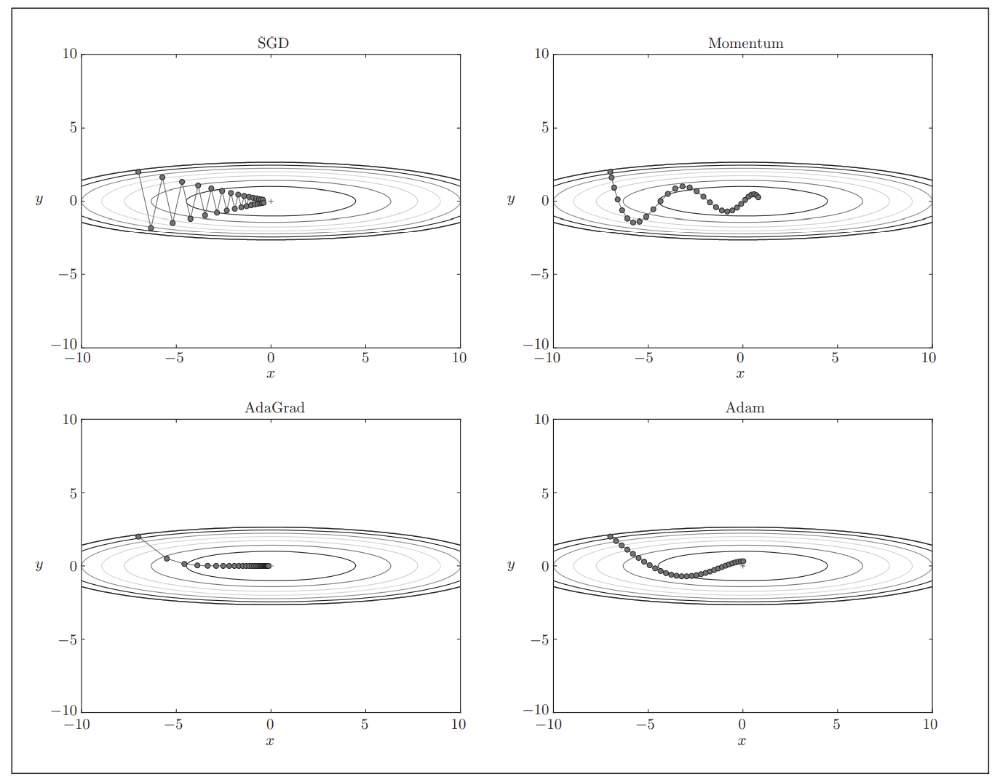

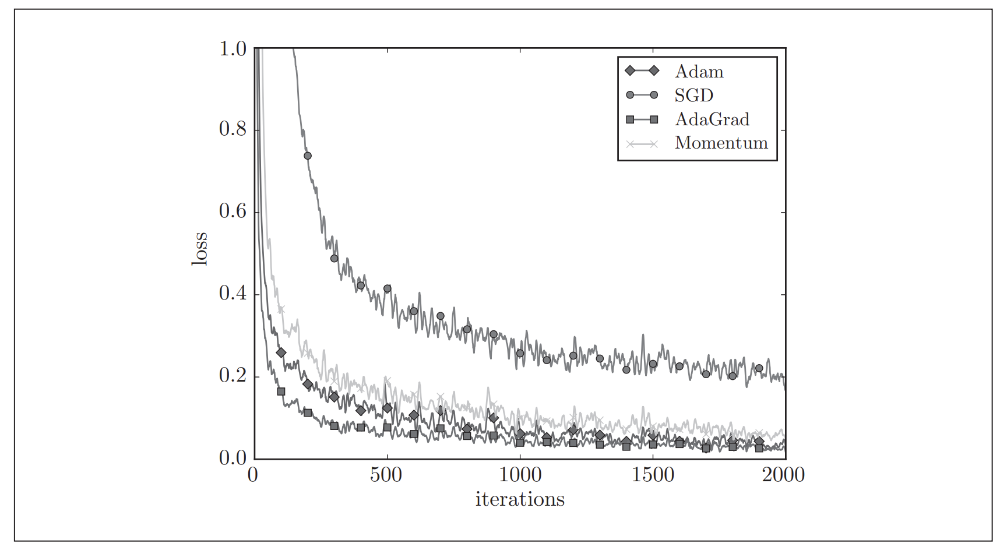

##### Q3神经网络为什么不能初始化相同的值

在误差反向传播法中，所有的权重值都会进行相同的更新，使得不同的权重丧失意义

如果第一层和第二层之间的权值相同，第二层每个单元会接收到相同的输出。

反向传播的时候，第二层权重全部都会进行相同的更新

**Q4初始化选择**

各层的激活值(经过激活函数后的输出)的分布都要求有适当的广度

传递的是有所偏向的数据，就会出现梯度消失或者“表 现力受限”的问题

Xavier初始值:与前一层有n个节点连接时，初始值使用标准差为$\frac{1}{\sqrt{n}}$的高斯分布

Xavier初始值是以激活函数是线性函数为前提而推导出来的。因为 sigmoid函数和tanh函数左右对称，且中央附近可以视作线性函数，

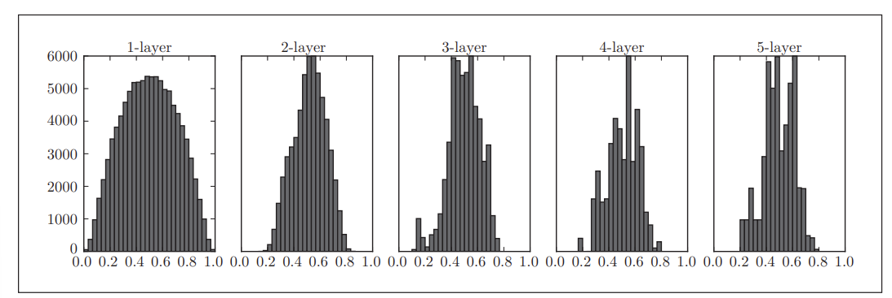

He初始值:使用标准差为$\frac{2}{\sqrt{n}}$的高斯分布

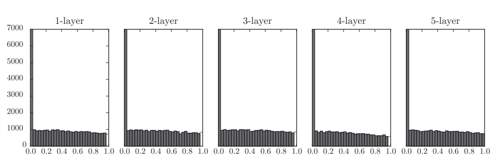

**Feature Scaling**

如果特征大小差的比较远的话，loss function会很扁平，数值更大的feature的参数会对结果的影响更大，这样在训练过程中，不同的方向需要设定不同的学习率，这样子会不太方便，这不是我们想看到的，所以我们通常会去做feature scaling。

**Batch Normalization**
$$
\mu_B := \frac{1}{m}\sum_{i=1}^{m}{x_i}
\newline\sigma_B^2:=\sqrt{\frac{1}{m}\sum_{i=1}^{m}{(x_i-\mu_B)^2}}
\newline\hat{x_i}:=\frac{x_i-\mu_B}{\sqrt{\sigma_B^2+\varepsilon}}
$$

- **每一层的激活函数前做batch normalization**
- 我们观察了各层的激活值分布，并从中了解到如果设定了合适的权重初始值，则各层的激活值分布会有适当的广度。
- “强制性”地调整激活值的分布
- 优点
  - 可以使学习快速进行（可以增大学习率）。 
  - 不那么依赖权重初始值（对于初始值不用那么神经质）。 
  - 抑制过拟合（降低Dropout等的必要性）

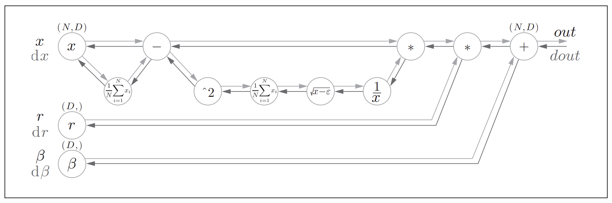**抑制过拟合**

正则化，Dropout

### CNN

**填充（padding）**

**步幅（stride）**

假设输入大小为(H, W)，滤波器大小为(FH, FW)，输出大小为 (OH, OW)，填充为P，步幅为S。
$$
OH = \frac{H+2P-FH}{S}+1
\newline OW = \frac{W+2P-FW}{S}+1
$$

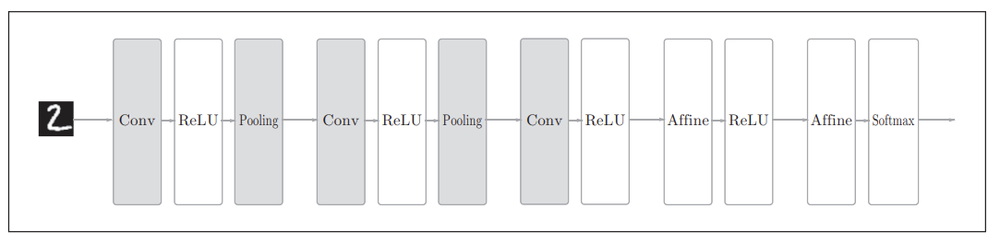

通道数只能设定为和输入数据的通道数相同的值

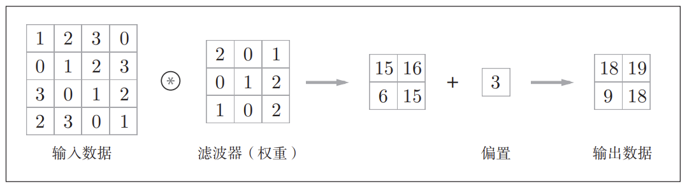

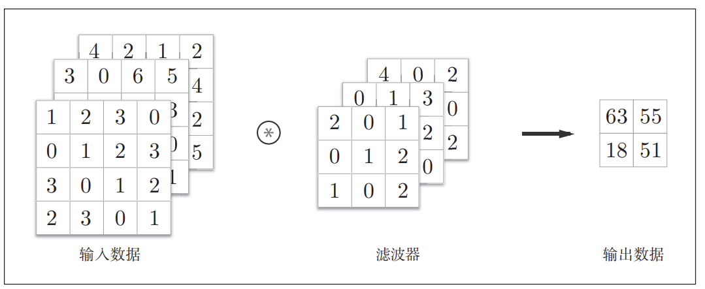

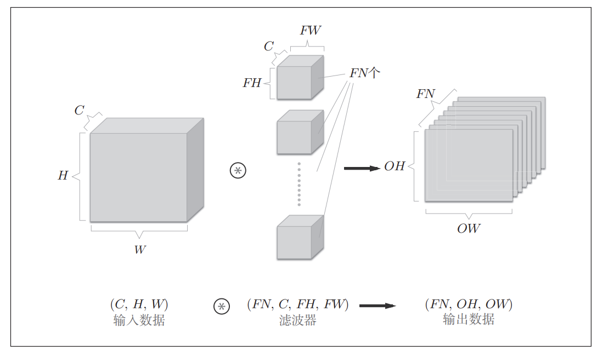

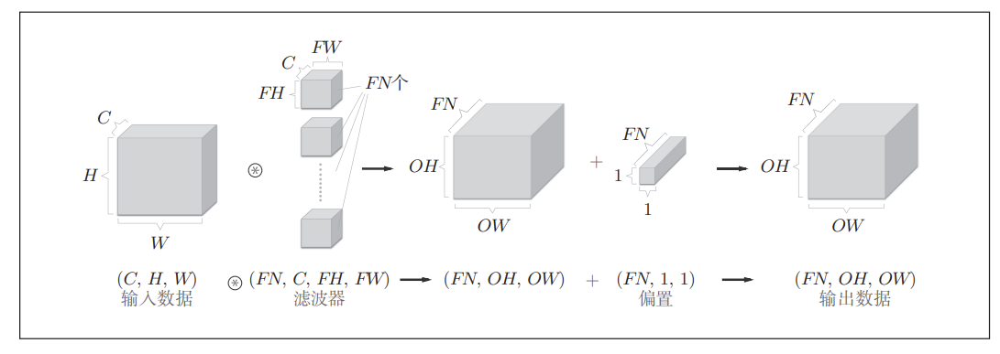

通过应用FN个滤波器，输出特征图也生成了FN个。如果 将这FN个特征图汇集在一起，就得到了形状为(FN, OH, OW)的方块。

通道数为C、高度为H、 长度为W的数据的形状可以写成（C, H, W）

滤波器的权重数据要按(output_channel, input_ channel, height, width)的顺序书写

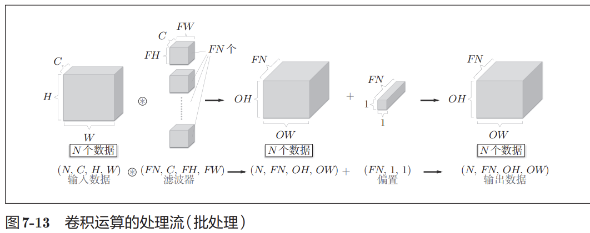

在各层间传递的数据保存为4维数据(batch_num, channel, height, width)

**Pooling池化层**

池化是缩小高、长方向上的空间的运算。比如，如图7-14所示，进行将 2 × 2的区域集约成1个元素的处理，缩小空间大小。
